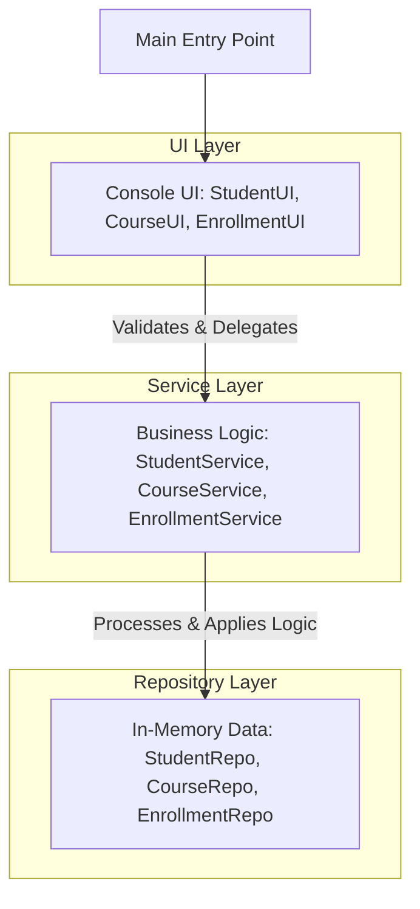
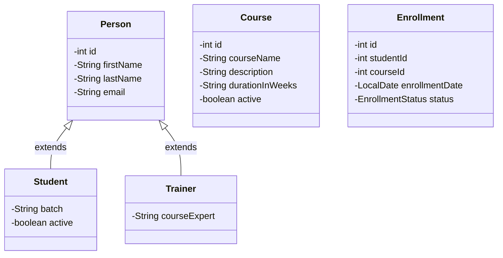

# Student-Course-Manager (LearnTrack)

A Low-Level Design (LLD) implementation of a comprehensive Student and Course Management System, also known as LearnTrack. 

This project demonstrates clean architecture using pure Java with zero external dependencies. It focuses on separating concerns through UI, Service, and Repository layers while employing Object-Oriented Programming (OOP) principles like inheritance, encapsulation, and custom exception handling.

## 🚀 Key Features

- **Student Management:** Register, display, and deactivate student records.
- **Course Management:** Add new courses, view course details, and manage course statuses.
- **Enrollment Management:** Enroll students in courses, track enrollment status, and manage active enrollments.
- **Data Integrity:** Implements robust input validation and customized exception handling (`EntityNotFoundException`, `InvalidInputException`).
- **In-Memory Storage:** Uses Java Collections (`List`, `ArrayList`) for repository data management without needing a database setup.

## 🏗️ Architecture & Design

The application follows a strictly layered architecture to decouple presentation, business logic, and data storage:



### Class Diagram (Entity Relationships)



## 🛠️ Technology Stack

- **Language:** Java
- **Java Version:** JDK 26 (Configured in `.idea/misc.xml`. Also backwards-compatible with Java 17+)
- **Environment:** Pure Java Console Application (No frameworks or external libraries)

## 📋 Prerequisites

To run this application locally, you must have the following installed:
- [Java Development Kit (JDK)](https://jdk.java.net/26/) - Version 26 is defined in project settings, but Java 17 or higher should suffice.
- A terminal or command prompt to compile and execute the source code.

## ⚙️ How to Run the Application

Follow these steps to compile and execute the application from the command line:

1. **Navigate to the project directory:**
   ```bash
   cd /Users/juhi/Airtribe/projects/Student-Course-Manager-LLD
   ```

2. **Create an output directory for compiled classes:**
   ```bash
   mkdir -p out
   ```

3. **Compile the Java source files:**
   Compile all `.java` files from the `src` directory into the `out` directory.
   ```bash
   javac -d out $(find src -name "*.java")
   ```
   *(For Windows Command Prompt, use: `dir /s /B src\*.java > sources.txt` and then `javac -d out @sources.txt`)*

4. **Run the application:**
   Execute the `Main` class to start the interactive console application.
   ```bash
   java -cp out com.airtribe.learntrack.Main
   ```

## 📂 Project Structure

```text
src/com/airtribe/learntrack/
├── config/         # AppContainer for dependency injection & setup
├── constants/      # Enums for Menus and Statuses (e.g., EnrollmentStatus)
├── entity/         # Core POJOs (Person, Student, Trainer, Course, Enrollment)
├── exception/      # Custom Exceptions (EntityNotFoundException, InvalidInputException)
├── repository/     # In-memory data storage classes
├── service/        # Core business logic processing
├── ui/             # Command-line interface and user interaction
├── util/           # Helper classes (IdGenerator, InputValidator)
└── Main.java       # Application entry point
```

## 🤝 Contribution & Maintenance
- Ensure any new entity follows the central `IdGenerator` logic.
- The `AppContainer` in the `config` package is responsible for wiring up and injecting singleton instances of UI, Service, and Repository classes.
